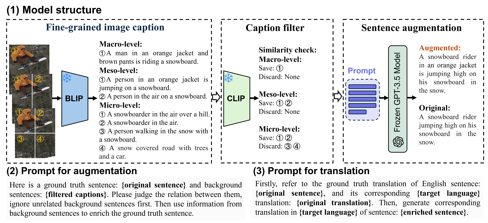

# Lambda
This is the official implementation for the paper ["LAMBDA: Large Language Model-Based Data Augmentation for Multi-Modal Machine Translation"](https://aclanthology.org/2024.findings-emnlp.893/) accepted by EMNLP2024.

## Model Structure



## Citation

If you find our work helpful, please cite as:
```
@inproceedings{wang-etal-2024-lambda,
    title = "{LAMBDA}: Large Language Model-Based Data Augmentation for Multi-Modal Machine Translation",
    author = "Wang, Yusong  and
      Li, Dongyuan  and
      Shen, Jialun  and
      Xu, Yicheng  and
      Xu, Mingkun  and
      Funakoshi, Kotaro  and
      Okumura, Manabu",
    editor = "Al-Onaizan, Yaser  and
      Bansal, Mohit  and
      Chen, Yun-Nung",
    booktitle = "Findings of the Association for Computational Linguistics: EMNLP 2024",
    month = nov,
    year = "2024",
    address = "Miami, Florida, USA",
    publisher = "Association for Computational Linguistics",
    url = "https://aclanthology.org/2024.findings-emnlp.893",
    doi = "10.18653/v1/2024.findings-emnlp.893",
    pages = "15240--15253",
}
```
